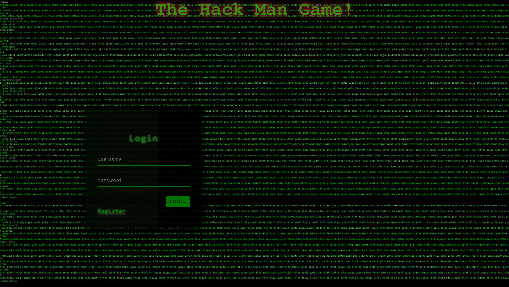
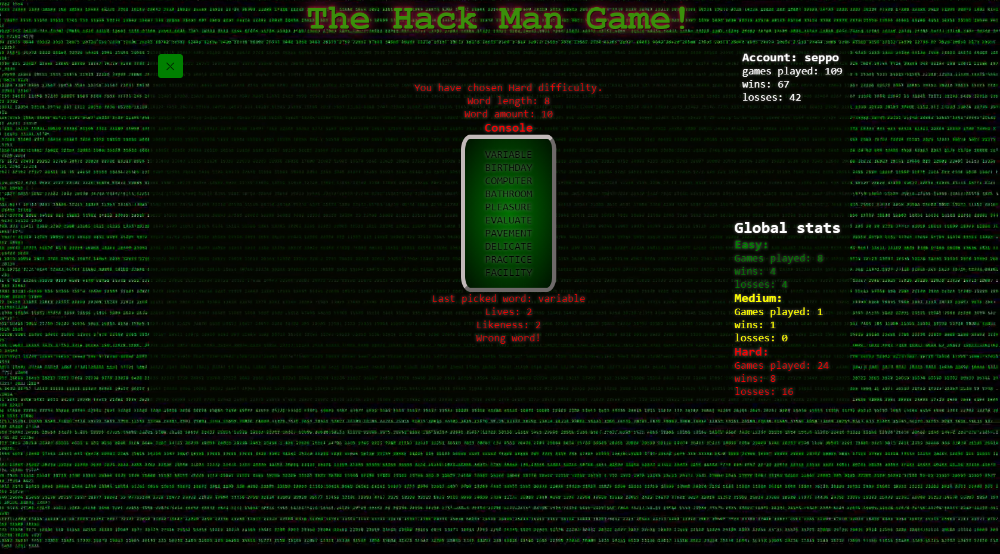

# Hack_man

The purpose of Hack_man game is to guess the right word in the terminal. By guessing a word you get approximation on how close the word is to the right word, which is determinated by the position of the same letters and each guess expends 1 life point when starting life points are 3. 

## example results when picking word
CHOCOLATE and CHRISTMAS has a likeness of 2 because there are C and H letters are in the same "index".
EFFECT AND EXTENT has a likeness of 3 thanks to letters two E letters and one T letter being in same position in the words.
 
Hack_man tracks your own stats (games played, wins and losses) and global stats based on difficulty. The user is able to change difficulty to his/her liking. The harder the difficulty the longer the words are and also the word amount is increased. Hack_man also supports custom settings (custom word amount and word length), but the stats are not tracked.

*Picture of the login screen.*

*Picture of the game screen.*
